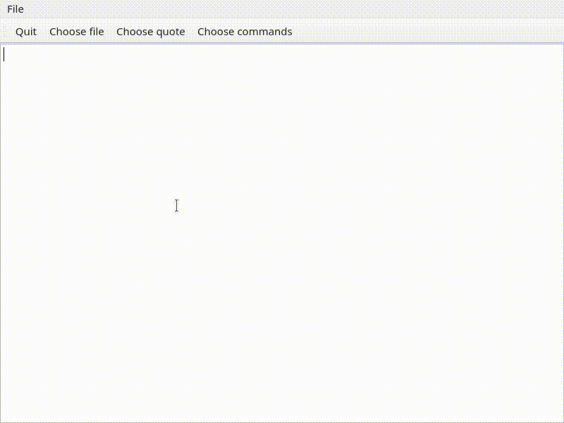

# CommandPaletteWideget

This is a Qt widget that behaves like the command pallete funnd
in modenr



Features:

* You can feed it any `QAbstractItemModel` (tree based models 
are still WIP).
* When the user chosess an item - a singal is emited.


## Basic usage

Feeding it a list of strings:

``` c++
auto commandPalette = new CommandPalette(this);
auto model = new QStringListModel({
    "All you need is love.",
    "We all want to change the world.",
    "Here comes the sun.",
    "I get by with a little help from my friends.",
    "With a little help from my friends.",
    "Let it be.",
    "Come together, right now.",
    "I want to hold your hand.",
    "Help! I need somebody.",
    "Imagine all the people living life in peace.",
    "You say goodbye and I say hello.",
    "Yesterday, all my troubles seemed so far away.",
    "I am the walrus.",
    "Lucy in the sky with diamonds.",
    "Hey Jude, don't make it bad."},
    this
);
commandPalette->setDataModel(model);
commandPalette->clearText();
commandPalette->show();
connect(commandPalette, &CommandPalette::didChooseItem, this,
        [model this](const QModelIndex index, const QAbstractItemModel *model) {
    QMessageBox msgBox;
    msgBox.setWindowTitle("Message");
    msgBox.setText(index.data().toString());
    msgBox.exec();
});
```

You can also feed it a the list of available commands, from your window.
Note the function `collectWidgetActions()` which is in this library.

```C++
auto commandPalette = new CommandPalette(this);
auto model = new ActionListModel(this);
model->setActions(collectWidgetActions(this));
commandPalette->setDataModel(model);
connect(commandPalette, &CommandPalette::didChooseItem, this,
        [](const QModelIndex &index, const QAbstractItemModel *model) {
    auto data = model->data(index, Qt::UserRole);
    auto action = data.value<QAction *>();
    if (action) {
        action->trigger();
    }
});
```

## Integration

You can use CPM - https://github.com/cpm-cmake/CPM.cmake

```CMake
include(CPM.cmake) 
CPMAddPackage("gh:diegoiast/command-palette-widget#main") 
```

You can use a git subtree, and add that subdirectory:
```
add_subdirectory(libs/3rd-party/command-pallete-widget)
```

Alternative option: copy the following files to your project, and 
build as usual.

```
include/CommandPaletteWidget/CommandPalette
include/CommandPaletteWidget/commandpalette.h
src/commandpalette.cpp
```

